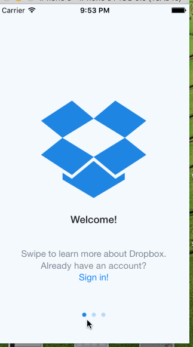

# Dropbox
1. Required: Added the three welcome screens

2. Required: Create Account/Sign in. After leaving the Welcome Screens the customer can't return to those screens. If they hit the back button, they can access the signed out page and sign in or create account

3. Required: Implemented two copies of the signed out page for createAccount and signedIn each of which immediately segue into their respective forms

4. Required: CreateAccount-Implemented intermediate screens, at the last screen, the terms must be agreed to before account is created. The view terms are also accessible. after creatng an account, a tab screen with favorites, photos, files and settings is displayed. Settings is scrollable and the customer can log out back to the sign in view controller.

5. Required: SignIn: implemented the required flows,after which the the tabs are displayed similar to create account.

Did not get a chance to implement the tapping of the forgot password flow. Will try and do that before class tomorrow.
Didn't implement the optional elements.

I have uploaded the dropbox.gif file as part of this project. 
Note: Spent close to 10-12 hours on this assignment. Considerable time was spent on just getting used to xcode..moving things around to setup segues, selections often made the elements zoom in big. Would love some tips on how to speed up the use of the emulator.
Found that I wanted to rename my swift files...tried that manually but finally deleted and started from scratch.
One last thing that I learnt the hard way was dragging images from the media library to a view controller. Works beautifully sometimes and sometimes doesnt. I spent close to an hour on this and discovered that I could set it using the other inspectors..:)

